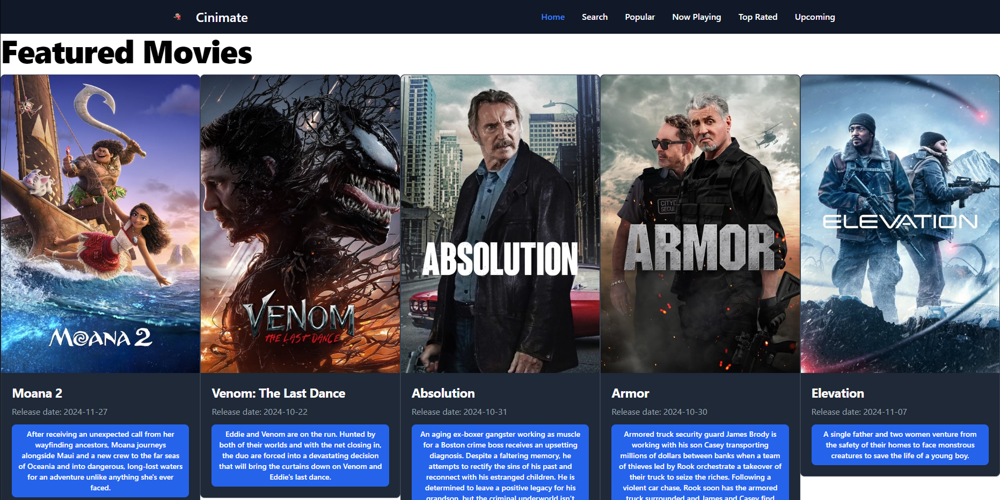

<h1>Cinemate</h1>

    Cinemate to aplikacja internetowa zbudowana w <strong>Nuxt.js</strong>, która pozwala użytkownikom przeglądać informacje o filmach i serialach przy wykorzystaniu API The Movie Database (TMDb). 
    Aplikacja jest hostowana na platformie <strong>Netlify</strong> i dostępna pod 
    <a href="https://cinimate.netlify.app" target="_blank">tym linkiem</a>.

<h2>Funkcjonalności aplikacji:</h2>
<ul>
    <li>
        <strong>Strona główna:</strong>
        
Wyświetla najbardziej znane filmy i seriale, zapewniając użytkownikom szybki dostęp do popularnych treści.

    </li>
    <li>
        <strong>Wyszukiwarka (Search):</strong>
        
Pozwala na wyszukiwanie filmów i seriali poprzez wpisanie ich tytułów w polu wyszukiwania. Wyniki wyświetlane są w przejrzysty sposób, z informacjami o tytule, dacie premiery, opisie i popularności.

    </li>
    <li>
        <strong>Zakładki tematyczne:</strong>
        <ul>
            <li><strong>Now Playing:</strong> Wyświetla listę filmów aktualnie granych w kinach.</li>
            <li><strong>Upcoming:</strong> Lista filmów, które będą miały premierę w najbliższym czasie.</li>
            <li><strong>Popular:</strong> Najpopularniejsze filmy i seriale.</li>
            <li><strong>Top Rated:</strong> Zestawienie najlepiej ocenianych filmów.</li>
        </ul>
    </li>
</ul>

<h2>Technologie użyte w projekcie:</h2>
<ul>
    <li>Nuxt.js</li>
    <li>API The Movie Database (TMDb)</li>
    <li>Tailwind CSS</li>
    <li>Netlify (do hostingu aplikacji)</li>
</ul>

<h2>Instalacja Tailwind CSS:</h2>
<ol>
    <li>Zainstaluj Tailwind CSS jako zależność deweloperską:
        <pre><code>npm install --save-dev @nuxtjs/tailwindcss</code></pre>
    </li>
    <li>Dodaj moduł Tailwind CSS do pliku <code>nuxt.config.ts</code>:
        <pre><code>
modules: [
  '@nuxtjs/tailwindcss'
]
        </code></pre>
    </li>
    <li>Uruchom projekt, aby sprawdzić, czy Tailwind działa poprawnie:
        <pre><code>npm run dev</code></pre>
    </li>
</ol>

<h2>Jak uruchomić projekt lokalnie:</h2>
<ol>
    <li>Skopiuj repozytorium na swój komputer:
        <pre><code>git clone https://github.com/nazwa-uzytkownika/nazwa-repozytorium.git</code></pre>
    </li>
    <li>Zainstaluj zależności:
        <pre><code>npm install</code></pre>
    </li>
    <li>Uruchom serwer deweloperski:
        <pre><code>npm run dev</code></pre>
    </li>
    <li>Otwórz przeglądarkę i przejdź pod adres <code>http://localhost:3000</code>.</li>
</ol>

<h2>Link do projektu:</h2>

    Aplikacja jest dostępna publicznie pod tym linkiem: 
    <a href="https://cinimate.netlify.app" target="_blank">https://cinimate.netlify.app</a>.

<h2>Zrzut ekranu:</h2>

    

<h2>Autor:</h2>

    Projekt został wykonany przez Maikel jako część kursu Nuxt.js.

